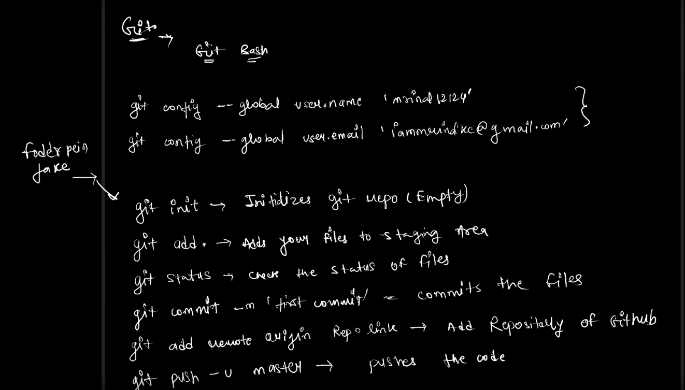

## GitHub :
#### git : 
- version control system
#### GitHub commands : 
- 30 dec
- search gitbash :
   - 1st step : 
   - go to gitbash -> get commands
     - git config --global user.name "userName" (github userName)
     - git config --global user.email "email" (github prr jis email se login liaa hai)
     - 

