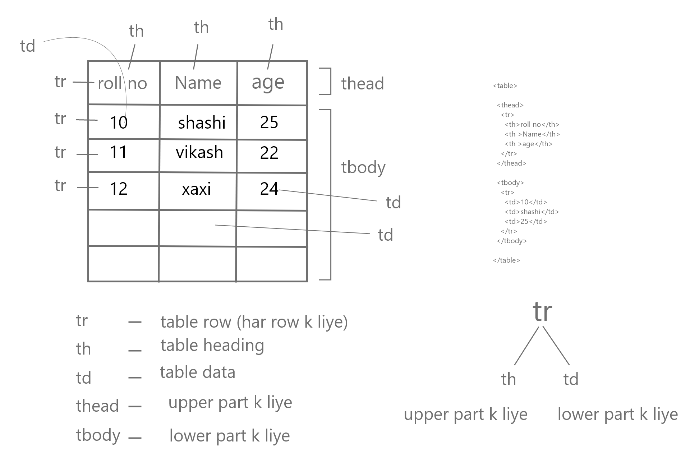

```js
<table>

  <thead>
    <tr>
      <th>roll no</th>
      <th >Name</th>
      <th >age</th>
    </tr>
  </thead>

  <tbody>
    <tr>
      <td>10</td>
      <td>shashi</td>
      <td>25</td>
    </tr>
  </tbody>

</table>

```